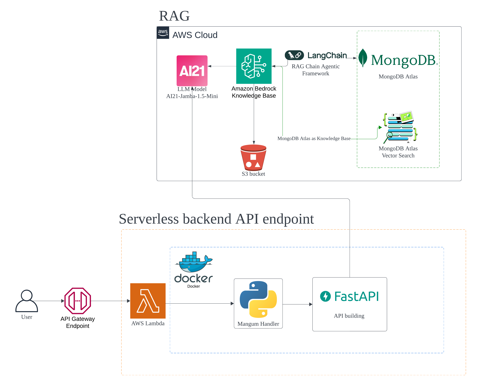

# IntelliFoods Backend

## Backend Architecture



## TechStack Used

- Amazon Bedrock: Core LLM & knowledge base
- Amazon S3 Storage : Storage for Recipe Data
- MongoDB Atlas: Vector search & data storage
- LangChain: RAG framework & chain management
- FastAPI + Lambda: Serverless API
- Docker: Containerization
- AWS CDK: Infrastructure

## Getting Started

### Setup the Python Environment for Local Development

```bash
cd image
python -m venv venv
source venv/bin/activate
pip install -r requirements.txt
```

### Configure AWS

You need to have an AWS account, and AWS CLI set up on your machine. You'll also need to have Bedrock enabled on AWS (and granted model access to Claude or whatever you want to use). For my case, I used `AI21-Jamba-1.5-Mini`

### Update .env File with AWS Credentials

Create a file named `.env` in image/. Do NOT commit the file to .git. The file should have content like this:

```bash
AWS_ACCESS_KEY_ID=XXXXX
AWS_SECRET_ACCESS_KEY=XXXXX
AWS_REGION=us-east-1
```

This will be used by Docker for when we want to test the image locally. The AWS keys are just your normal AWS credentials and region you want to run this in (even when running locally you will still need access to Bedrock LLM)

## Setup the Bedrock Knowledge Bases and MongoDB Atlas Vector Search

[documentation reference](https://www.mongodb.com/docs/atlas/atlas-vector-search/ai-integrations/amazon-bedrock/)

### Prerequisties

- set your AWS region into `us-east-1` region as Atlas Vector Search is currently available as a knowledge base only in AWS regions located in the United States.
- Enable [MongoDB Atlas in AWS Marketplace](https://www.mongodb.com/docs/atlas/billing/aws-self-serve-marketplace/)
- Create an Atlas M10+ cluster running MongoDB version 6.0.11, 7.0.2, or later.
- Access to the following foundation models used in this project in your Bedrock:
  - Amazon Titan Embeddings G1 - Text
  - Jamba 1.5 Mini
  
### Data Ingestion into S3 Bucket

Create the S3 Bucket that store the recipe data.

#### Run the Data Preparation Python Script to ingest the data and metadata.json into the S3 Bucket

```bash
cd image
python code/data_collection.py
```

`metadata.json` is needed for `metadata filtering`.

[Bedrock Metadata Filtering Reference](https://aws.amazon.com/blogs/machine-learning/amazon-bedrock-knowledge-bases-now-supports-metadata-filtering-to-improve-retrieval-accuracy/)

can check your S3 Bucket to ensure that the data is ingested correctly.

### Create the Atlas Vector Search Index and Atlas Vector as a vector database in MongoDB Atlas

create a new database called `recipe_db`
create a new collection called `recipe_vector`

Note: the name can change accordingly.

go to Atlas Search page and define `Atlas Vector Search index`

put the index name as `vector_index_recipe`

and put the definition below for the index

```bash
{
  "fields": [
    {
      "numDimensions": 1536,
      "path": "embedding",
      "similarity": "cosine",
      "type": "vector"
    },
    {
      "path": "metadata",
      "type": "filter"
    },
    {
      "path": "text_chunk",
      "type": "filter"
    }
  ]
}
```

Review the index definition and then Click Create Search Index then we are good to go.

### Create a Bedrock Knowledge Base

go to the Amazon Bedrock Console and click Knowledge bases.

Click Create knowledge base and put its name as `recipe-mongodb-atlas-knowledge-base`. You can change it accordingly.

#### Add a data source

Enter the URI for the S3 bucket that you created just now as the data source.

After that, choose `Titan Embeddings G1-Text` as embedding models to convert the data source into vector embeddings.

#### Connect Atlas to the Knowledge Base

choose `mongoDB Atlas` as the vector database.

##### Configuration for MongoDB Atlas as Vector DB in knowledge bases

- For the `Hostname`, enter the URL for your Atlas cluster located in its connection string. The hostname uses the following format:

```bash
<clusterName>.mongodb.net
```

- For Database name, enter `recipe_db`
- For Collection name, enter `recipe_vector`
- For the Credentials secret ARN, enter the ARN for the secret that contains your Atlas cluster credentials.

###### AWS Secret Manager to store the Atlas Credentials

go to your AWS Secret Manager and store the Atlas Credentials in the format below.

Store in `Key/Value` format

| Secret Key      | Secret Value      |
| ------------- | ------------- |
| username | "mongoDB atlas-username" |
| password | "mongoDB atlas-password" |

then retrieve the `Secret ARN` for this credentials and use it in the knowledge bases creation.

###### Metadata Field Mapping

In the Metadata field mapping section, configure the following options to determine the search index and field names that Atlas uses to embed and store your data source:

- For the Vector search index name, enter `vector_index`.

- For the Vector embedding field path, enter `embedding`.

- For the Text field path, enter `text_chunk`.

- For the Metadata field path, enter `metadata`.

#### Review and create the knowledge base

After reviewing the details for your knowledge base, click Create knowledge base to finalize your creation.

#### Sync the data source

After Amazon Bedrock creates the knowledge base, it prompts you to sync your data. In the `Data source` section, select your data source and click `Sync` to sync the data from the S3 bucket and load it into Atlas.

When the sync completes, you can view your vector embeddings in the Atlas UI by navigating to the `recipe_db.recipe_vector` collection in your cluster.

now you have created the knowledge bases successfully. Can proceed to the next step which is running the FastAPI server to test the knowledge base.

## Change the KNOWLEDGE_BASE_ID accordingly

once you created the knowledge base successfully, go to `image/src` and find the variable `KNOWLEDGE_BASE_ID` and change the variable to your own KNOWLEDGE_BASE_ID accordingly.

## Running the FastAPI Server Locally

```bash
cd image
python src/main.py
```

Then go to `http://0.0.0.0:8000/docs` to try it out.

## Run in Docker Environment

### Build the Docker Image

```bash
docker build -t recipe-api .
```

### Run the Docker Image as a Server Locally

```bash
docker run --rm -p 8000:8000 \
    --entrypoint python \
    --env-file .env \
    recipe-api main.py
```

After running the Docker container on localhost, you can access an interactive API page locally to test it: `http://0.0.0.0:8000/docs`.

## Deploy to AWS Lambda

### Install the Node dependencies

```bash
cd lambda-rag-cdk-infra

npm install
```

### Deploy the FastAPI into Lambda Serverless Function

```bash
cdk deploy
```

You will get the deployed Lambda URL and you can test out the deployed fastAPI endpoint using that URL.

#### Note for Lambda Deployment

Make sure that you have setup the AWS CLI in your machine and AWS CDK already bootstrapped. If haven't bootstrap, run the code below.

```bash
cdk bootstrap
```

#### Delete the lambda deployment

If you want to stop the lambda deployment, run the code below.

```bash
cdk destroy
```
